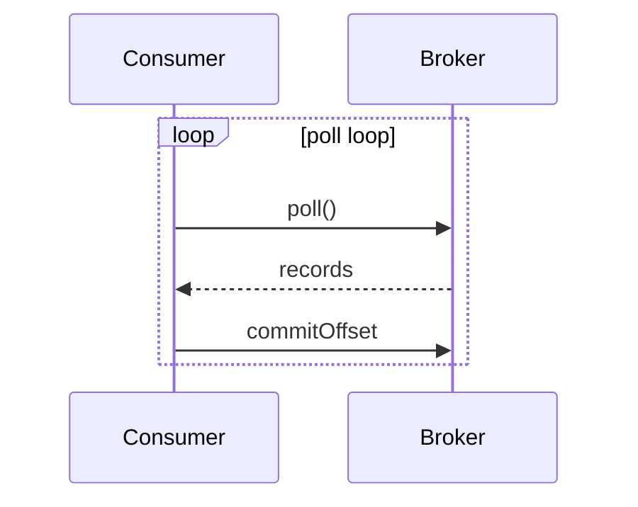

# 콘텐츠 운영 플로우 (작업 합의)

[English](./CONTENT_WORKFLOW.md) · 한국어

콘텐츠 품질과 반영 속도를 동시에 맞추기 위해, 작성/검토/반영 단계를 분리합니다.

- 1단계(작성): 작성자는 **검토용 포맷**으로 초안 전달
- 2단계(검토): 에이전트가 개념 설명을 보강한 **README(.md)** 제시
- 3단계(반영): 승인 후 어드민 패널에서 **↑ Import**로 DB 반영

> 드래프트 README는 `drafts/` 폴더 아래에 생성합니다. 이 폴더는 `.gitignore`에 포함되어 있어 저장소에는 올라가지 않습니다.

## 데이터베이스

- **DBMS:** PostgreSQL
- **테이블:** topics, sections, concepts, concept_revisions (private 용 _private 접미사 테이블 별도 존재)
- **ID 타입:** text (UUID 등 사용)
- **컬럼명:** title (name 아님)

### 구조 관계도

```
Topic (주제)
│   예) "JavaScript", "운영체제", "네트워크"
│   하나의 큰 학습 주제 단위
│
└── Section (섹션) [1:N]
    │   예) "비동기 처리", "프로세스 관리", "TCP/IP"
    │   Topic을 구성하는 챕터/묶음 단위
    │
    └── Concept (개념) [1:N]
        │   예) "Promise", "async/await", "이벤트 루프"
        │   실제 학습 콘텐츠 단위 (설명, 레벨, 질문 포함)
        │
        └── Concept (자식 개념) [parent_concept_id, 선택]
                예) "Promise.all", "Promise.race"
                부모 개념의 세부 개념으로 트리 구조 가능
```

**관계 요약**

- `Topic` 1 → N `Section`
- `Section` 1 → N `Concept`
- `Concept` 0 → N `Concept` (self-referencing, parent_concept_id)
- `Concept`은 `topic_id`도 직접 보유 (section 없이 topic 기준 조회 가능)

### 스키마

전체 테이블 정의와 RLS 정책은 [SETUP.ko.md](./SETUP.ko.md#2-스키마-생성) 참고.

## README Import / Export

콘텐츠를 마크다운 README 파일로 관리하고, DB와 양방향으로 동기화합니다.
SQL을 직접 작성하는 것보다 README로 편집하는 것이 더 자연스럽고 리뷰/버전 관리도 용이합니다.

### README 파일 포맷 (파싱 기준)

헤딩 계층으로 Topic → Section → Concept 구조를 표현합니다.

```markdown
# {Topic title}

{Topic description (선택)}

## {Section title}

{Section description (선택)}

### {Concept title}

> level: basic | deep
> questions: 질문1 | 질문2

{Concept description}

{Concept content — 상세 설명, 실무 맥락 등. 여러 줄 가능}
```

**규칙**

- `#` — Topic (파일 당 1개)
- `##` — Section (여러 개 가능)
- `###` — Concept (각 Section 아래 여러 개 가능)
- Concept 바로 아래 `>` blockquote로 메타 표기 (`level`, `questions`)
- `level` 허용값: `basic`, `deep` (없으면 NULL, 별도 언급 없으면 생략 가능)
- `questions`는 `|` 구분자로 여러 개 입력
- description과 content는 blockquote 이후의 본문으로 처리
  - 첫 번째 단락 → `description`
  - 이후 본문 전체 → `content`
- 자식 Concept은 `####`으로 표현 (parent_concept_id 자동 연결)

**예시**

```markdown
# JavaScript

자바스크립트 핵심 개념 모음

## 비동기 처리

비동기 프로그래밍 패턴과 런타임 동작 원리

### Promise

> level: basic
> questions: Promise란 무엇인가 | then과 catch의 차이는

비동기 작업의 최종 완료 또는 실패를 나타내는 객체.

콜백 지옥을 해결하기 위해 ES6에서 도입됐으며, 체이닝을 통해 순차 처리와
에러 핸들링을 명시적으로 표현할 수 있다.

#### Promise.all

> level: deep

여러 Promise를 병렬로 실행하고 모두 완료될 때까지 기다리는 메서드.
```

---

### Import 흐름 (README → DB)

```
어드민 패널에서 ↑ Import 버튼 클릭
  → .md 파일 선택
  → 파싱 결과 미리보기 (섹션/개념 수, level, child 표시)
  → 확인 후 upsert 실행
  → concept_revisions 자동 백필
```

**매칭 기준 (upsert key)**

| 엔티티 | 매칭 기준 |
|---|---|
| Topic | `title` |
| Section | `topic_id` + `title` |
| Concept | `section_id` + `title` |

**동작 규칙**

- 기존 동일 title의 Topic/Section/Concept이 있으면 `UPDATE`, 없으면 `INSERT`
- 기존 Topic의 `color`, `tags`, `sort_order` 등 README에 없는 필드는 그대로 보존
- `sort_order`는 파일 내 등장 순서 기준 (기존 항목은 기존 값 유지, 신규만 끝에 추가)
- import 직전 DB에서 최신 데이터를 다시 로드하여 stale 캐시로 인한 중복 생성 방지
- `concept_revisions`에 `change_type: create | update` 자동 기록

> **참고**: Import는 전체 upsert 방식입니다. 변경된 부분만 반영하는 것이 아니라, title이 일치하는 항목의 전체 내용을 README 내용으로 교체합니다. README 파일에는 변경된 부분만 포함시켜야 의도치 않은 전체 교체를 방지할 수 있습니다.

### Export 흐름 (DB → README)

```
어드민 패널에서 항목 선택 후 ↓ Export 버튼 클릭
  → 현재 선택된 토픽 전체를 README 포맷으로 변환
  → {topic-slug}.md 파일로 자동 다운로드
```

- 파일명 컨벤션: `{topic-title-kebab-case}.md`
- `sort_order` 순서대로 Section → Concept 나열
- 자식 Concept은 `####`으로 들여쓰기
- `level`, `questions` 있는 경우 blockquote로 출력

---

## 1) 작성자가 주는 검토용 포맷

아래 템플릿으로 주면, 에이전트가 설명형으로 정리하고 누락 개념을 보강합니다.

```yaml
topic: AI
sections:
  - title: Agent
    concepts:
      - title: Agent
        summary: 의도를 파악하고 실행까지 수행하는 AI
        detail: 2~4문장 설명
      - title: Plan-Act-Observe
        summary: 계획-실행-관찰 루프
        detail: 2~4문장 설명
  - title: Ontology
    concepts:
      - title: Ontology
        summary: 개체-관계-규칙 지식 체계
        detail: 2~4문장 설명
```

## 2) 에이전트가 주는 드래프트 (README)

- 위 "README 파일 포맷" 규칙에 맞춰 `drafts/{topic-slug}.md` 로 생성
- 각 Concept: `정의(무엇인지) + 중요성(왜 필요한지) + 실무 맥락`
- 변경 유형은 커밋 메시지나 PR 코멘트로 표시: `신규 / 수정 / 유지`
- **DB 제약 준수**
  - `level` 허용값: `basic`, `deep` (생략 시 NULL)
  - `intermediate` 같은 비허용 값 사용 금지
  - 동일 `title`의 기존 Topic/Section/Concept과 충돌 여부를 먼저 확인

### Mermaid 다이어그램

사이트는 concept의 `content` 내 Mermaid 다이어그램을 렌더링한다. 텍스트보다 시각화가 이해에 명확히 도움이 되는 경우에만 사용하고, 모든 concept에 넣을 필요는 없다.

**넣으면 좋은 경우**
- 컴포넌트 간 데이터 흐름 (예: Producer → Topic → Consumer)
- 상태/생애주기 시퀀스 (예: poll 루프, 리밸런싱 절차)
- 산문으로 표현하기 어려운 트리/계층 구조

**생략해도 되는 경우**
- 단순 정의·용어 설명
- 짧은 문장으로 구조가 충분히 전달되는 경우

**사용법** — concept 본문 안에 `mermaid` 언어로 펜스드 코드블록을 삽입:

````markdown
### Consumer

Kafka 토픽에서 레코드를 읽어가는 클라이언트다.

...


````

지원 다이어그램 타입: `flowchart`, `sequenceDiagram`, `block-beta` 등 표준 Mermaid 타입 대부분 지원.

## 3) 반영 (Import)

1. 어드민 패널 접속 (`/admin`)
2. 반영할 모드 선택 (Public / Private)
3. **↑ Import** 버튼 → `drafts/{topic-slug}.md` 선택
4. 파싱 미리보기 확인 (섹션/개념 수, level, child 표시)
5. 확인 후 반영 — upsert + `concept_revisions` 자동 기록

> Import는 `title` 기준 매칭이므로, 이미 존재하는 항목은 업데이트, 없는 항목은 신규 생성됩니다.
> `color`, `tags`, `sort_order` 같이 README에 없는 필드는 기존 값이 보존됩니다.

### 반영 후 확인

- 토픽/섹션 정렬(`sort_order`)이 의도대로 되었는지 확인
- 각 Concept의 `level`, `title`, `description`, `content` 확인
- 필요 시 상세 화면의 Revision 히스토리에서 AS-IS / TO-BE 비교

## 4) Tech Notes

토픽/섹션/개념 트리와 달리, Tech Note는 **self-contained HTML 문서 한 개**가 통째로 하나의 노트다.
`notes` / `notes_private` 테이블에 HTML 을 통으로 저장하고, 앱에서는 격리된 iframe(`srcdoc`)으로 렌더한다.

### 저장 위치

| 경로 | 용도 | git |
|---|---|---|
| `drafts/notes/` | 공개 노트 원본 → `notes` 테이블 | 커밋함 |
| `drafts/notes-private/` | 비공개 노트 원본 → `notes_private` 테이블 | **`.gitignore` 처리됨** |

> 비공개 노트를 레포에 넣으면 GitHub Pages 로 그대로 서빙되므로 비공개가 아니게 된다.
> 반드시 `drafts/notes-private/` 에 두고 DB 로만 올린다.

### 노트 파일 형식

파일명은 `YYYY-MM-DD-slug.html`, 맨 앞에 메타 블록을 둔다:

```html
<!--ktree
title: 실시간 WebSocket 게이트웨이
date: 2026-09-03
summary: 목록 카드에 보일 한 줄 요약
domain: project-a     # 선택 — 프로젝트별 분류 (project-a / project-b / …)
-->
<title>실시간 WebSocket 게이트웨이 — 기술 노트</title>
...
```

메타 블록이 없으면 `<title>` 과 파일명에서 유추하고, CLI 플래그가 항상 우선한다.

### 템플릿

`drafts/templates/spec-note.html` — 기획/설계 산출물용 뼈대. 복사해서 쓰고 안 쓰는 섹션은 통째로 지운다.

배경 · 요구사항 · **유저 스토리/플로우** · 설계 · **API 변경** · **DB 변경** · 결정 기록 ·
트레이드오프 · 미해결.

> 굵게 표시한 셋은 비워두지 않는다. 이 문서를 나중에 읽는 사람은 대개 프론트 작업자이거나
> 몇 달 뒤의 나이고, 그들은 **그 세 섹션만 본다**. 설계 산문에 흩어놓고 여기서 생략하면
> 문서가 제 역할을 못 한다.

> 공개 개념 노트(`drafts/notes/`)와 설계 문서는 성격이 다르다.
> 전자는 개념 카드 나열, 후자는 결정과 근거의 기록 — 템플릿을 섞어 쓰지 않는다.

**색은 반드시 CSS 변수로만 참조한다.** 앱이 iframe 에 ktree 다크 팔레트를 주입하므로
`fill="#333"` 처럼 하드코딩한 색은 다크 테마에서 깨진다. SVG 다이어그램도 마찬가지로
`class` 를 주고 `var(--accent)` 같은 변수로 칠한다.

### 업로드

자격증명은 환경변수 `KTREE_EMAIL` / `KTREE_PASSWORD`, 또는 레포 루트의 `.env`(gitignore)에서 읽는다.

> `~/.zshrc` 는 **인터랙티브 셸에서만** 읽힌다. 거기 넣어둔 채로 스크립트·에이전트가 실행하면
> "자격증명이 없다"고 나온다. 그럴 땐 옮길 필요 없이 인터랙티브 셸로 감싸면 된다:
>
> ```bash
> zsh -ic 'cd ~/prj/ktree && node upload-note.mjs <파일> --private'
> ```
>
> 아예 안 걸리게 하려면 `~/.zshenv` 로 옮기거나 `.env` 를 쓴다.

```bash
export KTREE_EMAIL='you@example.com'
export KTREE_PASSWORD='...'

# 공개 노트
node upload-note.mjs drafts/notes/2026-09-03-realtime-websocket-gateway.html

# 비공개 노트
node upload-note.mjs drafts/notes-private/2026-09-12-internal.html --private

# 목록 확인 / 삭제
node upload-note.mjs --list
node upload-note.mjs --list --private
node upload-note.mjs --delete <slug> --private
```

`slug` 기준 upsert 이므로 같은 파일을 다시 올리면 덮어쓴다.
`--private` 업로드는 `user_access` 에 `access_type='private'` 행이 있는 계정만 RLS 를 통과한다.

### 앱에서 보기

- 공개 노트: 그냥 접속하면 사이드바 **Tech Notes** 에 보인다
- 비공개 노트: 로그인 후 모드 스위처에서 **PRIVATE** 선택 (`?mode=private`)

모드별로 해당 테이블만 조회하므로, PUBLIC 모드에서는 비공개 노트가 목록에 아예 나타나지 않는다.

### 나란히 보기 (2단 분할)

노트 툴바의 **"나란히 보기…"** 에서 다른 노트를 고르면 좌우로 붙는다. 설계 문서와 기획서 원문을
같이 볼 때 쓴다. 분할 중에는 우측 목차 레일이 자리를 내준다.

> 외부 URL 은 띄울 수 없다. 노션·claude.ai 는 `x-frame-options: SAMEORIGIN` 이라 브라우저가
> iframe 임베드를 거부한다 — 로그인돼 있어도 마찬가지다. 원문을 옆에 두려면 그 원문도
> private note 로 올려야 한다.

## 운영 원칙

- 원문/사용자 제공 내용을 1순위 기준으로 사용
- 에이전트는 필요한 맥락만 보강하되, 과도한 확장/창작 네이밍은 지양
- 설명은 메모형이 아니라 **개념 설명형**으로 작성
- 질문 없이 "아닙니다", "반대입니다" 같은 대답 형식 지양 - 직접 서술형으로 작성
- 토픽/섹션/컨셉 이름은 기존 저장소 톤(짧고 명확한 명사형)에 맞춤
- 모든 드래프트는 `drafts/` 폴더에 보관 (git 제외)
