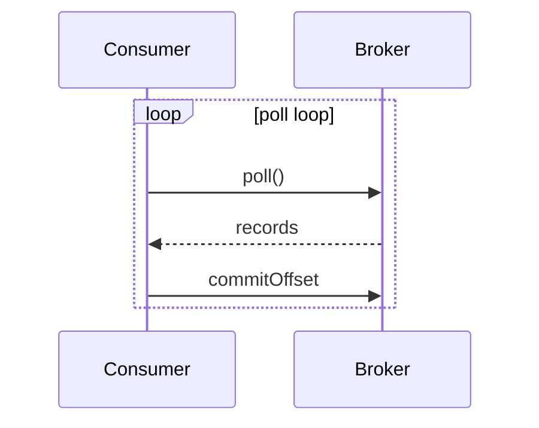

# Content Workflow

English · [한국어](./CONTENT_WORKFLOW.ko.md)

To balance content quality with speed of publishing, authoring, review, and persistence are split into three stages.

- **Stage 1 (Draft)** — the author sends a draft in the *review format*
- **Stage 2 (Review)** — the agent produces a README (`.md`) with enriched explanations
- **Stage 3 (Apply)** — once approved, use the admin panel's **↑ Import** to write to the DB

> Draft READMEs live under the `drafts/` folder. It's in `.gitignore`, so drafts stay out of the repository.

## Database

- **DBMS:** PostgreSQL
- **Tables:** `topics`, `sections`, `concepts`, `concept_revisions` (with `_private` suffix counterparts for Private mode)
- **ID type:** `text` (use UUID or any unique string)
- **Column name:** `title` (not `name`)

### Structure

```
Topic
│   e.g. "JavaScript", "Operating Systems", "Networking"
│   a top-level learning subject
│
└── Section [1:N]
    │   e.g. "Async programming", "Process management", "TCP/IP"
    │   chapter-level grouping within a topic
    │
    └── Concept [1:N]
        │   e.g. "Promise", "async/await", "Event loop"
        │   the actual content unit (description, level, questions, content)
        │
        └── Child Concept [parent_concept_id, optional]
                e.g. "Promise.all", "Promise.race"
                sub-concept of a parent; enables tree-shaped drill-downs
```

**Relations**

- `Topic` 1 → N `Section`
- `Section` 1 → N `Concept`
- `Concept` 0 → N `Concept` (self-reference via `parent_concept_id`)
- `Concept` also carries `topic_id` directly (so you can query by topic without joining sections)

### Schema

See [SETUP.md](./SETUP.md#2-create-the-schema) for the full table definitions and RLS policies.

## README Import / Export

You can manage content as a Markdown README file and sync it with the database in both directions.
Editing in Markdown is more natural than hand-writing SQL, and it plays well with review and version control.

### README format (parser rules)

Topic → Section → Concept are expressed via heading levels.

````markdown
# {Topic title}

{Topic description (optional)}

## {Section title}

{Section description (optional)}

### {Concept title}

> level: basic | deep
> questions: question 1 | question 2

{Concept description}

{Concept content — detailed explanation, practical context, etc. Multi-line OK}
````

**Rules**

- `#` — Topic (exactly one per file)
- `##` — Section (many per file)
- `###` — Concept (many per section)
- A `>` blockquote directly under a Concept encodes metadata (`level`, `questions`)
- `level` values: `basic`, `deep` (omit for `NULL`; omit if not specifically mentioned)
- `questions` are `|`-separated
- Body after the blockquote becomes `description` + `content`
  - first paragraph → `description`
  - everything after → `content`
- Child concepts are expressed as `####` and auto-linked via `parent_concept_id`

**Example**

````markdown
# JavaScript

Core JavaScript concepts

## Async programming

Async patterns and runtime internals

### Promise

> level: basic
> questions: What is a Promise | Difference between then and catch

An object representing the eventual completion or failure of an async operation.

Introduced in ES6 to solve callback hell; chaining makes sequential flow and
error handling explicit.

#### Promise.all

> level: deep

Runs multiple promises in parallel and waits until all of them resolve.
````

---

### Import flow (README → DB)

```
Click ↑ Import in the admin panel
  → pick a .md file
  → preview the parsed result (section/concept counts, levels, child markers)
  → confirm to run the upsert
  → concept_revisions are auto-written
```

**Match keys (upsert)**

| Entity | Match key |
|---|---|
| Topic | `title` |
| Section | `topic_id` + `title` |
| Concept | `section_id` + `title` |

**Behavior**

- If a Topic/Section/Concept with the same title exists, `UPDATE`; otherwise `INSERT`
- Fields not present in the README (e.g. Topic `color`, `tags`, `sort_order`) are preserved
- `sort_order` follows file order (existing items keep their value; new items go to the end)
- Before import, the latest DB state is re-fetched to avoid duplicate inserts from a stale cache
- `concept_revisions` get `change_type: create | update` automatically

> **Note**: Import uses full upsert semantics. It replaces the entire content of matching items with the README content, not just the changed parts. To avoid unintended full replacement, include only changed content in the README file.

### Export flow (DB → README)

```
Select a topic in the admin panel, then click ↓ Export
  → the entire topic is serialized into README format
  → downloaded as {topic-slug}.md
```

- File naming: `{topic-title-kebab-case}.md`
- Emits sections and concepts in `sort_order`
- Child concepts are rendered as `####`
- Blockquote metadata is only emitted when `level` / `questions` are present

---

## 1) Author's review format

Given the template below, the agent rewrites it into explanatory prose and fills in any missing concepts.

```yaml
topic: AI
sections:
  - title: Agent
    concepts:
      - title: Agent
        summary: An AI that understands intent and takes action
        detail: 2–4 sentences of detail
      - title: Plan-Act-Observe
        summary: The plan → act → observe loop
        detail: 2–4 sentences of detail
  - title: Ontology
    concepts:
      - title: Ontology
        summary: An entity–relation–rule knowledge system
        detail: 2–4 sentences of detail
```

## 2) Agent's draft (README)

- Produce `drafts/{topic-slug}.md` that follows the *README format* above
- For each concept: `definition + why it matters + real-world context`
- Mark the change type in the commit message or PR comment: `new / updated / unchanged`
- **Respect DB constraints**
  - `level` allowed values: `basic`, `deep` (omit for `NULL`)
  - Do not use non-allowed values like `intermediate`
  - Check for title collisions with existing Topic/Section/Concept rows beforehand

### Mermaid diagrams

The site renders Mermaid diagrams inside concept `content`. Use them only where a visual makes the explanation meaningfully clearer — not for every concept.

**Good candidates**
- Data flow between components (e.g. Producer → Topic → Consumer)
- State/lifecycle sequences (e.g. poll loop, rebalance steps)
- Tree or hierarchy structures that are hard to read as prose

**Skip diagrams when**
- The concept is a simple definition
- A short sentence already makes the structure obvious

**Usage** — place a fenced code block with `mermaid` as the language inside the concept body:

````markdown
### Consumer

Kafka 토픽에서 레코드를 읽어가는 클라이언트다.

...


````

Supported diagram types: `flowchart`, `sequenceDiagram`, `block-beta`, and most standard Mermaid types.

## 3) Apply (Import)

1. Open the admin panel (`/admin`)
2. Choose the target mode (Public / Private)
3. Click **↑ Import** → select `drafts/{topic-slug}.md`
4. Review the parse preview (section/concept counts, levels, child markers)
5. Confirm — runs the upsert and writes `concept_revisions` automatically

> Import matches by `title`, so existing items are updated and new items are inserted.
> Fields not present in the README (e.g. `color`, `tags`, `sort_order`) keep their current values.

### After import

- Check that `sort_order` is correct for topics and sections
- Verify each concept's `level`, `title`, `description`, `content`
- If needed, compare AS-IS / TO-BE in the revision history on the detail view

## 4) Tech Notes

Unlike the topic/section/concept tree, a Tech Note is **one self-contained HTML document**.
The HTML is stored whole in the `notes` / `notes_private` tables and rendered in an isolated
iframe (`srcdoc`) inside the app.

### Where sources live

| Path | Target | git |
|---|---|---|
| `drafts/notes/` | public notes → `notes` table | committed |
| `drafts/notes-private/` | private notes → `notes_private` table | **git-ignored** |

> Anything committed to the repo is served by GitHub Pages, so a "private" note placed in the
> repo is not private. Keep private notes in `drafts/notes-private/` and ship them to the DB only.

### Note file format

Name files `YYYY-MM-DD-slug.html` and put a metadata block at the very top:

```html
<!--ktree
title: Realtime WebSocket Gateway
date: 2026-09-03
summary: One-line summary shown on the list card
domain: project-a     # optional — groups by project (project-a / project-b / …)
parent: 2026-01-01-design   # optional — attach to another note; hidden from the list
-->
<title>Realtime WebSocket Gateway — Tech Note</title>
...
```

Without the block, the title and date are inferred from `<title>` and the filename.
CLI flags always win.

### Template

`drafts/templates/spec-note.html` — skeleton for planning/design write-ups. Copy it and delete
whole sections you don't use.

Background · requirements · **user stories/flow** · design · **API changes** · **DB changes** ·
decision log · trade-offs · open questions.

> Don't leave the three bolded sections empty. Whoever reads this later is usually a frontend
> dev or you in three months, and they read **only those three**. Scattering the same facts
> through the design prose and skipping these defeats the document.

> Public concept notes (`drafts/notes/`) and design docs are different animals — the former
> is a run of concept cards, the latter a record of decisions and their rationale. Don't mix
> the templates.

**Reference colors through CSS variables only.** The app injects the ktree dark palette into
the iframe, so a hardcoded `fill="#333"` breaks under the dark theme. Give SVG shapes a
`class` and paint them with `var(--accent)` and friends.

### Uploading

Credentials come from the `KTREE_EMAIL` / `KTREE_PASSWORD` environment variables, or from a
`.env` file at the repo root (git-ignored).

> `~/.zshrc` is read by **interactive shells only**. To cover scripts and agents running the
> upload on your behalf, put the exports in `~/.zshenv` or use `.env`.

```bash
export KTREE_EMAIL='you@example.com'
export KTREE_PASSWORD='...'

# public note
node upload-note.mjs drafts/notes/2026-09-03-realtime-websocket-gateway.html

# private note
node upload-note.mjs drafts/notes-private/2026-09-12-internal.html --private

# list / delete
node upload-note.mjs --list
node upload-note.mjs --list --private
node upload-note.mjs --delete <slug> --private
```

Upload is an upsert on `slug`, so re-uploading the same file overwrites it.
`--private` uploads only pass RLS for accounts holding an `access_type='private'`
row in `user_access`.

### Viewing in the app

- Public notes: visible under **Tech Notes** in the sidebar for everyone
- Private notes: log in, then pick **PRIVATE** in the mode switcher (`?mode=private`)

Each mode queries only its own table, so private notes never appear in PUBLIC mode.

### Side-by-side view

Pick another note from **"나란히 보기…"** in the note toolbar to open it in a right-hand pane —
handy for reading a design doc next to its source spec. The TOC rail steps aside while split.

> External URLs cannot be shown. Notion and claude.ai send `x-frame-options: SAMEORIGIN`, so the
> browser refuses to embed them in an iframe — being logged in doesn't help. To read a source
> document alongside a note, upload that document as a private note too.

## Operating principles

- Treat the original/author-provided content as the primary source of truth
- The agent only enriches where needed; avoid over-expanding or inventing new names
- Write in *explanatory* prose, not bulleted memos
- Avoid Q&A-style responses like "No" or "That's not it" without the question — write in direct declarative form
- Keep topic/section/concept names in the same tone as the existing repo (short, clear nouns)
- All drafts live in `drafts/` (git-ignored)
