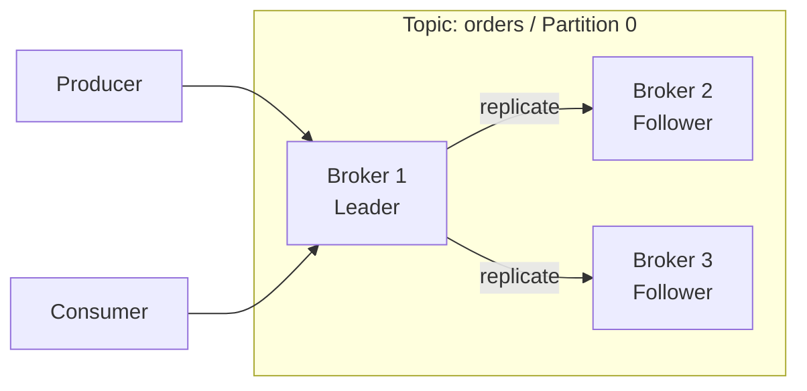
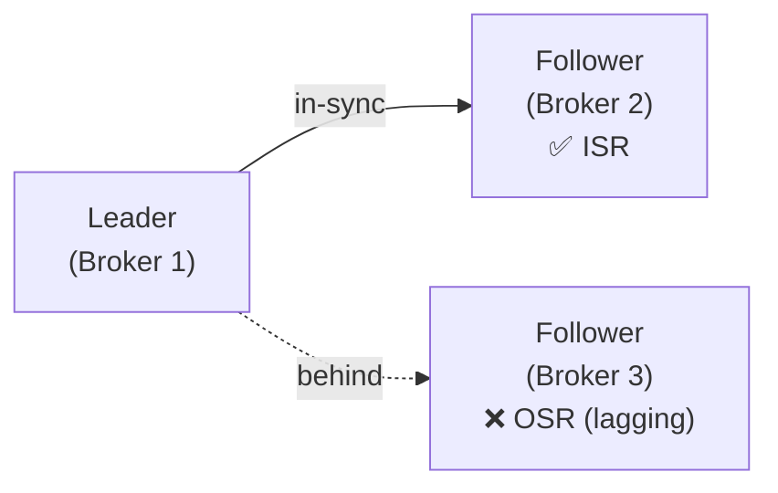
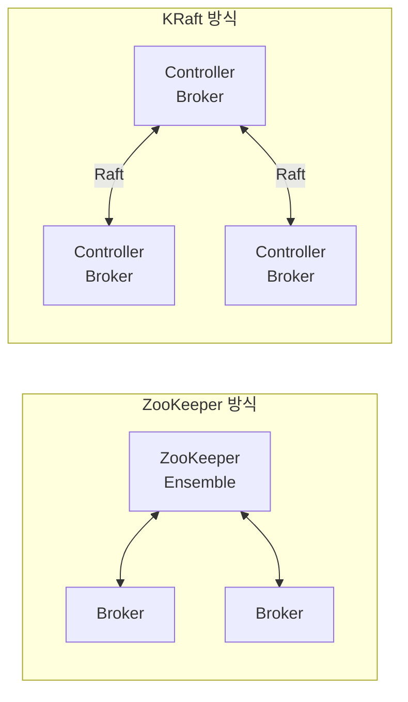
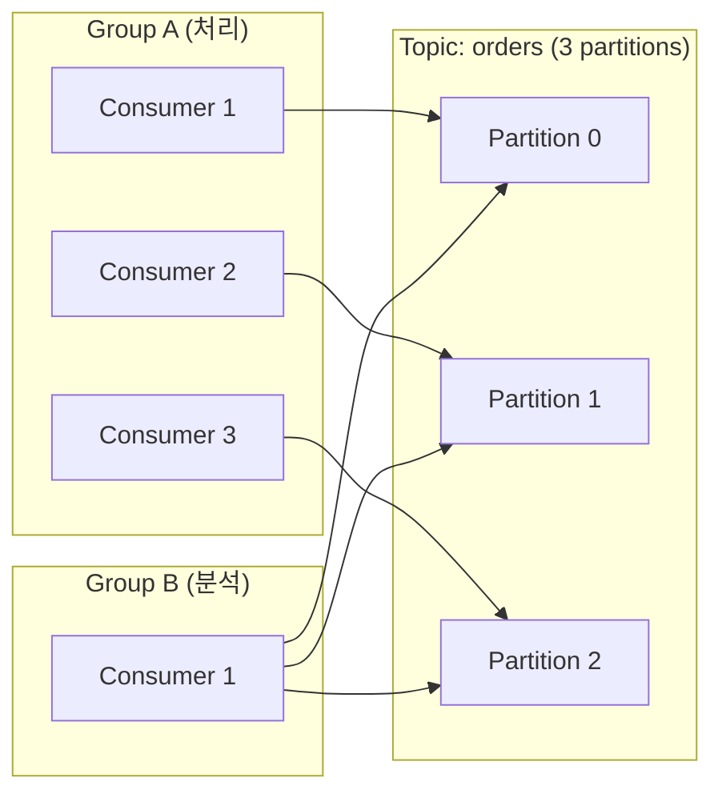
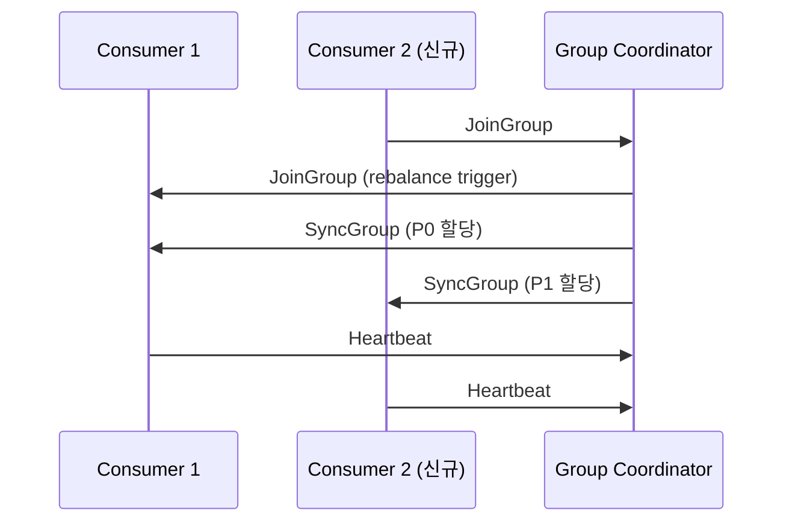

# Apache Kafka

분산 이벤트 스트리밍 플랫폼으로, 대용량 실시간 데이터를 내구성 있게 처리하기 위해 설계된 시스템이다.

## 아키텍처

Kafka 클러스터가 내결함성과 확장성을 확보하는 핵심 설계 원리.

### Replication

> level: basic
> questions: Kafka에서 복제란 무엇인가 | replication factor는 무엇을 의미하는가

파티션을 여러 브로커에 복사해 두는 메커니즘으로, 브로커 장애 시에도 데이터를 잃지 않게 한다.

토픽 생성 시 지정하는 `replication factor`가 복제본 수를 결정한다. 예를 들어 factor가 3이면 하나의 파티션이 서로 다른 브로커 3곳에 저장된다. 복제본 중 하나는 리더(Leader), 나머지는 팔로워(Follower) 역할을 맡는다. 프로듀서와 컨슈머는 리더하고만 통신하며, 팔로워는 리더를 복제하는 역할만 한다.

### Leader / Follower

> level: basic
> questions: Leader와 Follower의 역할 차이는 | 리더가 죽으면 어떻게 되는가

파티션 복제본 중 읽기/쓰기를 담당하는 리더와, 리더를 복제만 하는 팔로워로 역할이 나뉜다.

모든 프로듀서 쓰기와 컨슈머 읽기는 리더를 통해서만 이루어진다. 팔로워는 리더로부터 지속적으로 레코드를 fetch해 동기화를 유지한다. 리더 브로커가 장애를 겪으면 ISR 목록에 있는 팔로워 중 하나가 새 리더로 선출되어 서비스가 자동 복구된다. 클러스터 전체로 보면 각 브로커가 일부 파티션의 리더를 맡고 나머지는 팔로워로 동작해 부하가 분산된다.

### ISR (In-Sync Replica)

> level: deep
> questions: ISR이란 무엇인가 | ISR에서 제외되는 조건은

리더와 충분히 동기화된 상태를 유지하고 있는 복제본 집합이다.

팔로워가 `replica.lag.time.max.ms` 안에 리더를 따라잡지 못하면 ISR에서 제외(OSR)된다. 리더 장애 시 새 리더는 ISR 안에서만 선출되므로, ISR 관리가 데이터 유실 방지의 핵심이다. 프로듀서의 `acks=all` 설정은 ISR 전체가 레코드를 기록해야 쓰기 성공으로 처리하므로, ISR 크기가 내구성과 직결된다.

### ZooKeeper vs KRaft

> level: deep
> questions: Kafka는 왜 ZooKeeper를 사용했는가 | KRaft가 해결한 문제는

초기 Kafka는 클러스터 메타데이터 관리를 ZooKeeper에 위임했으나, Kafka 3.x부터 자체 합의 알고리즘인 KRaft로 전환 중이다.

ZooKeeper 방식에서는 브로커 등록, 리더 선출, 토픽 설정 등 메타데이터를 별도 ZooKeeper 앙상블이 관리했다. 이는 운영 복잡도를 높이고 컨트롤러 장애 복구 시간을 길게 만들었다. KRaft(Kafka Raft)는 Kafka 내부에 Raft 합의 프로토콜을 구현해 ZooKeeper 의존성을 제거하고, 메타데이터도 Kafka 로그로 관리한다. Kafka 4.0부터는 ZooKeeper 모드가 완전히 제거됐다.

### Consumer Group

> level: basic
> questions: Consumer Group이란 무엇인가 | 같은 토픽을 두 그룹이 읽으면 어떻게 되는가

동일한 토픽을 함께 소비하는 컨슈머 인스턴스들의 논리적 묶음이다.

그룹 내 컨슈머들은 토픽의 파티션을 나눠서 읽는다. 파티션 하나는 그룹 내 컨슈머 하나에만 할당되므로, 같은 레코드를 그룹 내에서 중복 처리하지 않는다. 반면 서로 다른 그룹은 같은 파티션을 독립적으로 읽을 수 있어, 동일 데이터를 분석/알림/저장 등 여러 목적으로 동시에 소비할 수 있다.

### Group Coordinator

> level: deep
> questions: Group Coordinator란 무엇인가 | 어떤 브로커가 코디네이터가 되는가

컨슈머 그룹의 멤버십과 오프셋 커밋을 관리하는 브로커다.

`__consumer_offsets` 토픽의 특정 파티션 리더 브로커가 해당 그룹의 코디네이터가 된다. 컨슈머는 시작할 때 코디네이터를 찾아 그룹에 참여(JoinGroup) 요청을 보내고, 코디네이터는 리밸런싱을 조율해 파티션 할당을 결정한다. 오프셋 커밋도 코디네이터를 통해 `__consumer_offsets`에 기록된다.

### Rebalancing

> level: deep
> questions: 리밸런싱이란 무엇인가 | 리밸런싱이 발생하는 조건은 | Stop-the-world 문제란

컨슈머 그룹 내에서 파티션 할당을 재조정하는 과정이다.

컨슈머가 그룹에 새로 참여하거나, 기존 컨슈머가 이탈하거나, 토픽 파티션 수가 변경될 때 발생한다. 기본 Eager 방식은 리밸런싱 동안 모든 컨슈머가 파티션을 반납하고 재할당을 기다리는 stop-the-world가 발생한다. Kafka 2.4부터 도입된 Cooperative(Incremental) 방식은 변경이 필요한 파티션만 이동시켜 중단 시간을 최소화한다. `session.timeout.ms`와 `heartbeat.interval.ms` 설정이 컨슈머 이탈 감지 속도와 리밸런싱 빈도에 영향을 준다.

