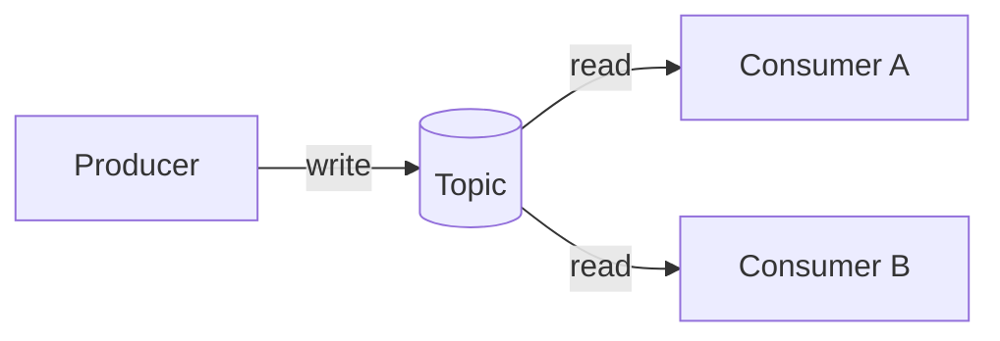
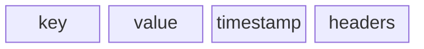
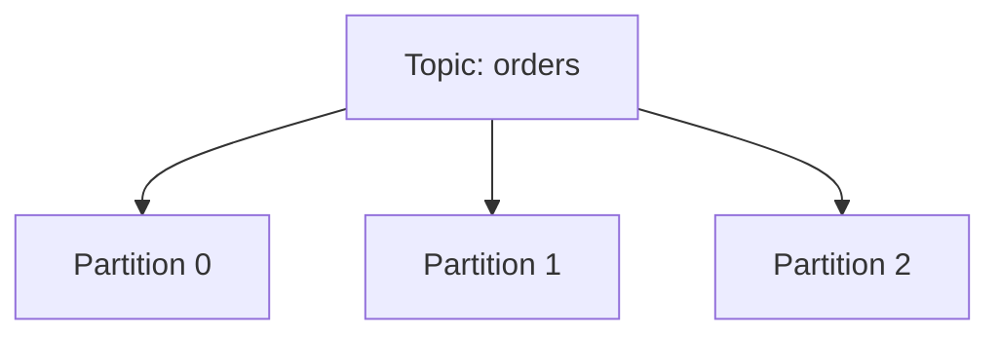
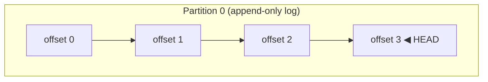
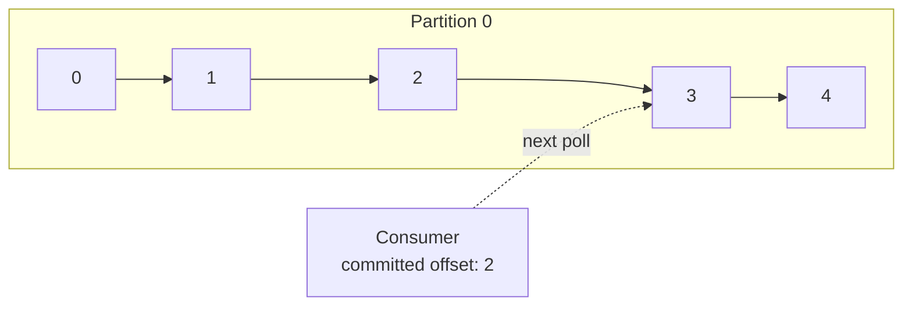
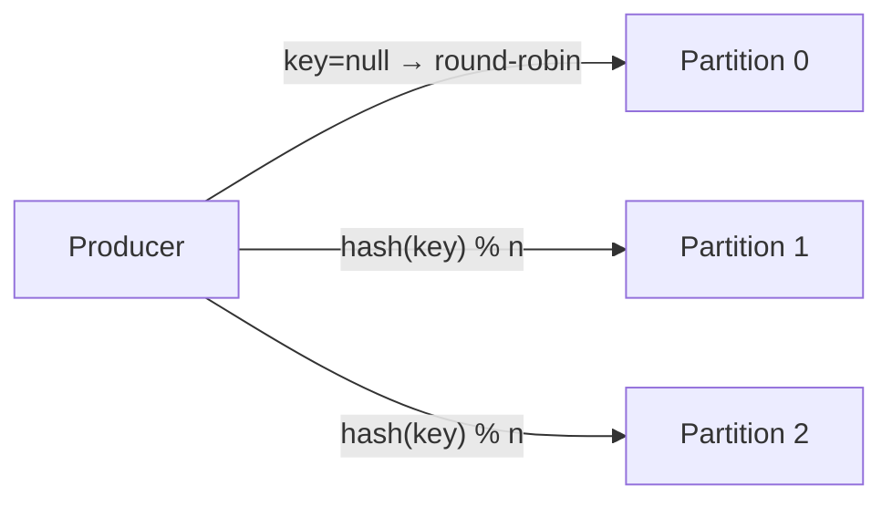
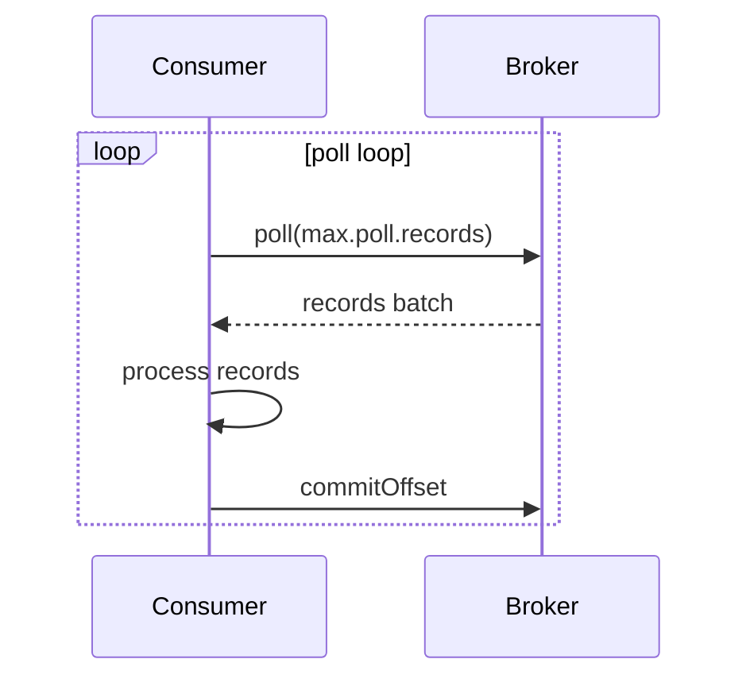
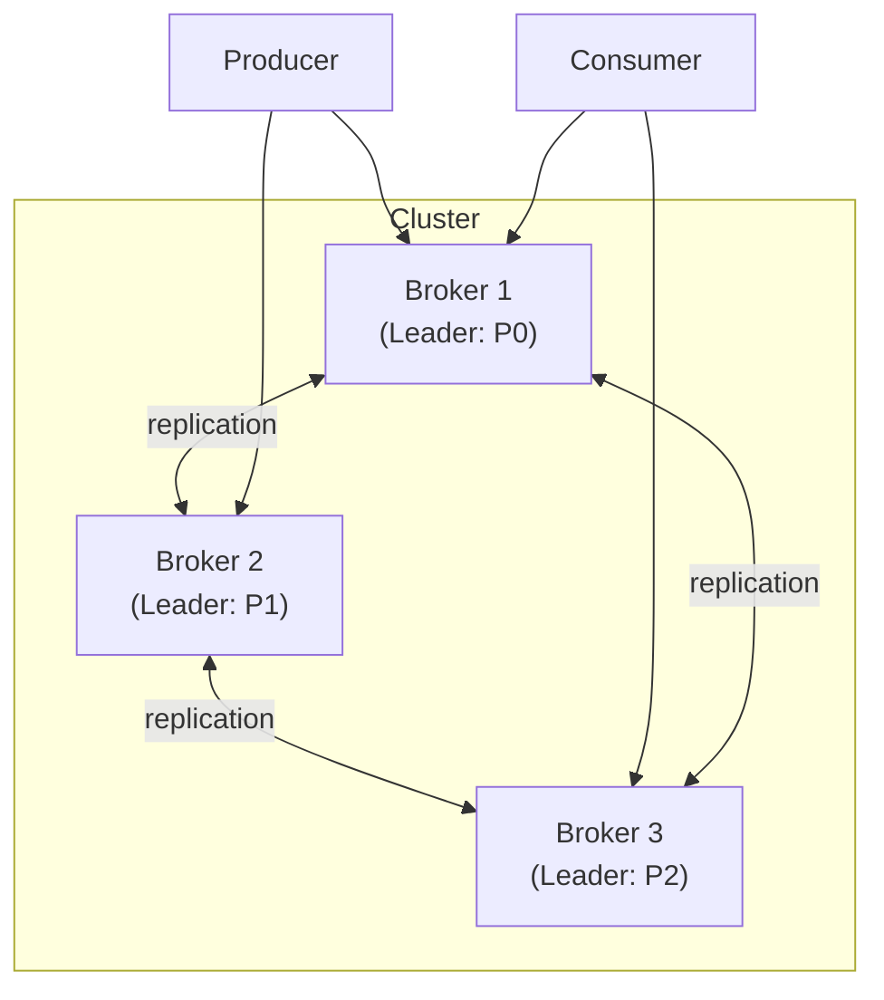

# Apache Kafka

분산 이벤트 스트리밍 플랫폼으로, 대용량 실시간 데이터를 내구성 있게 처리하기 위해 설계된 시스템이다.

## 핵심 개념

Kafka를 이해하는 데 필요한 기본 용어와 구성 요소.

### Kafka란

> level: basic
> questions: Kafka는 무엇인가 | 메시지 큐와 Kafka의 차이는

LinkedIn이 내부 데이터 파이프라인 문제를 해결하기 위해 개발한 분산 이벤트 스트리밍 플랫폼으로, 현재는 Apache 재단 오픈소스 프로젝트다.

전통적인 메시지 큐(RabbitMQ 등)와 달리 메시지를 소비 후 즉시 삭제하지 않고 디스크에 로그 형태로 보존한다. 이 덕분에 여러 컨슈머가 같은 데이터를 독립적으로 읽을 수 있고, 과거 시점으로 되돌아가 재처리도 가능하다. 높은 처리량, 낮은 지연, 내결함성을 동시에 달성하는 것이 핵심 설계 목표다.

### Message vs Event

> level: basic
> questions: 메시지와 이벤트의 차이는 | Kafka에서 레코드란 무엇인가

메시지는 단순히 시스템 간에 전달되는 데이터 단위를 의미하고, 이벤트는 "무언가가 발생했다"는 사실을 나타내는 불변의 기록이다.

Kafka는 이벤트 중심 설계를 따르기 때문에 공식 문서에서도 "메시지" 대신 "이벤트" 또는 "레코드"라는 표현을 선호한다. 레코드는 key, value, timestamp, headers로 구성되며, value에 실제 페이로드가 담긴다. key는 파티션 라우팅에 사용되므로 단순 식별자 이상의 의미를 갖는다.

### Topic

> level: basic
> questions: Topic이란 무엇인가 | Topic과 파티션의 관계는

프로듀서가 레코드를 발행하고 컨슈머가 구독하는 논리적인 채널이다.

데이터베이스의 테이블에 비유할 수 있지만, append-only 로그라는 점에서 근본적으로 다르다. 하나의 토픽은 여러 파티션으로 나뉘어 병렬 처리와 수평 확장을 가능하게 한다. 토픽 이름은 클러스터 내에서 고유해야 하며, 생성 시 파티션 수와 복제 인수(replication factor)를 지정한다.

### Partition

> level: basic
> questions: 파티션이란 무엇인가 | 파티션 수를 늘리면 어떤 효과가 있는가

토픽을 물리적으로 분할한 단위로, Kafka 병렬 처리의 핵심이다.

각 파티션은 순서가 보장된 불변 로그이며, 브로커 디스크에 파일로 저장된다. 프로듀서는 레코드의 key를 해시하여 어느 파티션에 쓸지 결정하고, 같은 key를 가진 레코드는 항상 같은 파티션으로 라우팅된다. 컨슈머 그룹 내에서 파티션은 컨슈머 인스턴스에 1:1로 할당되므로, 파티션 수가 최대 병렬 처리 단위를 결정한다.

### Offset

> level: basic
> questions: Offset이란 무엇인가 | 컨슈머가 offset을 관리하는 방법은

파티션 내 각 레코드에 부여되는 단조 증가 정수 식별자다.

컨슈머는 자신이 어디까지 읽었는지를 오프셋으로 추적하며, 이 정보를 Kafka 내부 토픽인 `__consumer_offsets`에 커밋한다. 오프셋 커밋 시점을 어떻게 설정하느냐에 따라 메시지 처리 보장 수준(at-least-once, at-most-once)이 달라진다. 오프셋을 과거로 되돌리면(seek) 이미 처리한 레코드를 재처리할 수 있다.

### Producer

> level: basic
> questions: Producer란 무엇인가 | Producer가 파티션을 선택하는 방법은

Kafka 토픽에 레코드를 발행하는 클라이언트다.

레코드 key가 있으면 key의 해시값으로 파티션을 결정하고, key가 없으면 라운드로빈 또는 sticky partitioner 방식으로 분산한다. 프로듀서는 배치 단위로 레코드를 묶어 전송하며, `linger.ms`와 `batch.size` 설정이 배치 동작을 제어한다. `acks` 설정으로 브로커의 쓰기 확인 수준을 조절해 처리량과 내구성 사이의 트레이드오프를 결정한다.

### Consumer

> level: basic
> questions: Consumer란 무엇인가 | Consumer가 메시지를 pull하는 이유는

Kafka 토픽에서 레코드를 읽어가는 클라이언트다.

Kafka 컨슈머는 브로커가 데이터를 밀어주는(push) 방식이 아니라, 컨슈머가 능동적으로 가져가는(pull) 방식을 사용한다. 이 덕분에 컨슈머가 자신의 처리 속도에 맞게 소비 속도를 조절할 수 있다. `poll()` 루프를 통해 레코드를 가져오며, 처리 후 오프셋을 커밋해 진행 상태를 기록한다.

### Broker

> level: basic
> questions: Broker란 무엇인가 | 브로커 클러스터는 어떻게 구성되는가

Kafka 클러스터를 구성하는 개별 서버 노드다.

브로커는 프로듀서로부터 레코드를 수신해 디스크에 저장하고, 컨슈머의 요청에 응답해 레코드를 전달한다. 여러 브로커가 모여 클러스터를 이루며, 각 파티션의 리더 역할을 나눠 맡는다. 브로커 중 하나가 장애를 겪어도 나머지 브로커가 해당 파티션의 리더를 이어받아 서비스 연속성을 유지한다.

